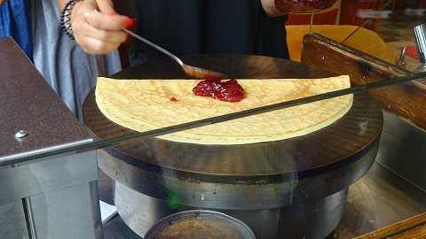

French Culture 
==============

School
------

Before university, children go to *l'école maternelle* (similar to preschool) and 
then *l'école primaire* from 3 to 5 years old and 6 to 10 years old. 

Then, children to go *collége* (a false cognate that actually means middle school) 
and then *lycée* (high school) from 11 to 14 years old and 15 to 18 years old. 

In France, unlike America, the school system is *laïque* which means no form of 
religion whatsoever. In the United States, however, schools must incorporate all 
religions. 

School is also mandatory but free. 

In France, like in the United States, there are also private schools, or des établissements 
privés. 

Unlike Americans, the French have to pass what's called le baccalauréat in order 
to go to university. This is kind of like a diploma at the end of high school graduation.
The difference? In America, we have a graduation ceremony; in France, they don't. 

Once a student enters college, they choose *une filière*, or a major, in humanities 
(history, pschology, English, German, etc.), medicine or pharmacy, economic and social science,
law or commerce and marketing. Students do not choose their courses. 

Campus life is also different. In France, people go to college solely for academics. 
In America, stress is placed more on the social aspect nowadays. 

Food 
----

 
 Crepe by Kyann Brown

French cuisine is the country's staple, and it's become a world treasure. The French
pride themselves in their food as it remains a prevalent part of their identity. 

Here are some popular foods that come from France: 

-- crêpes
-- baguettes
-- coq au vin 
-- chocolate mousse 
-- èclair
-- crème brûlée
-- quiche 
-- blanquette de veau
-- soupe à l’oignon
-- soupe de Poisson à la rouille
-- bœuf bourguignon

