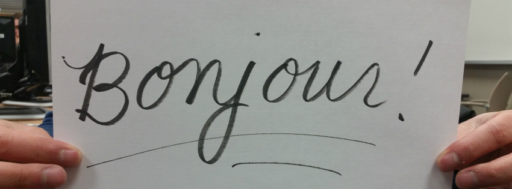

Introductory Phrases
======================

Welcome to our introductory phrases guide! Beginning to learn a new language starts 
with the basics. These phrases are intended to help you start a conversation and 
break the ice should you find yourself in a foreign country that speaks French. 
Any comments or questions? Let us know. 

Don't be a stranger. Say hello! 

*Bonjour*

Hello

This phrase, when translated literally, means "good day." It is a formal salutation 
used among strangers and acquaintances. It's also a more respectful way of saying 
hello. For less formal greetings, you can use "salut" or "ça va." 

*Comment vous appelez-vous?*

What's your name? 

The best way to ask someone his/her name is to use this phrase. It literally means 
"What do you call yourself?" Whomever you are speaking to will likely ask you the 
same question, so be prepared. Respond with "Je m'appelle '___.' 

*J'apprends le français mais je ne suis qu'un débutant.*

I'm learning French, but I'm only a beginner. 

When learning French as a second language, natives are usually understanding, as 
they adore (that's French, for your information) an American accent. But they also love their language. To show that you're at least attempting to speak their tongue, say that you're trying but your level is not proficient. They'll get a good chuckle out of it. 

*Je ne comprends pas.*

I don't understand. 

Admit it. You don't know it all -- especially when you're just starting out. When 
learning French, it's easier to read than to hear the language being spoken. If 
you don't understand something, simply ask for the speaker to repeat him/herself 
by saying, "Pouvez-vous répéter s'il vous plaît ?"

*Est-ce que tu me comprends?*

Do you understand?

Conversely, you are likely not to understand what the French native is saying because 
they are 1. speaking too fast or 2. using slang you might not be familiar with.  

*Comment dit-on '___' en français ?*

How do you say '___' in French? 

Because English is so prevalent in Europe, there's a considerable chance the person 
you are speaking to knows what you are trying to say. Or, if you're with a French 
professor on a trip but you don't want to break out into English just yet, ask for 
a hint.   

*Pardon*

Sorry

This is often used when interrupting a conversation to ask for help or bumping into 
someone. 

*Qu'est-ce qui se passe?*

What's happening? 

You're in a new place. You're in an entirely different culture. You don't know what's 
happening. No worries. Be in the know with this phrase. 

**Other useful phrases:**

*Je viens de...*

I come from...

*J'habite à...*

I live in... 