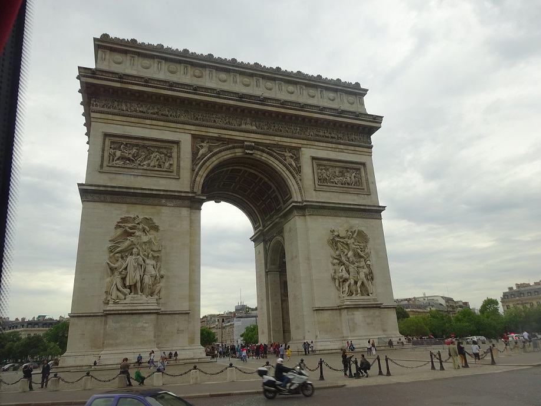
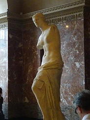
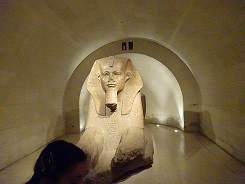
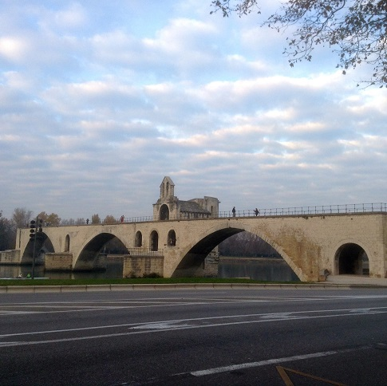

Places to Visit in France
=========================

There are several places that you will want to visit when or if you go to France. 

The top Three Places to Visit:
------------------------------

* The Eiffel Tower, Paris - The Eiffel Tower, built in 1887 - 1889 by Gustave Eiffel,
  is one of the most well known monuement in France. The tallest structure in Paris, 
  and the second tallest in France, the Eiffel Tower offers an amazing view from 
  the third level, which can be accessed either by stairs or elevator. 
  
.. figure:: eiffel.JPG
 :scale: 50 %
 :alt: Eiffel Tower, by Kyann Brown

* The Arc de Triomphe, Paris - The Arc de Triomphe, at almost 200 years old, was 
  built to honor the soldiers who fought for France, especially those that fought 
  during the Napoleonic Wars. The Arc de Triomphe also holds the **Memorial Flame**, which
  has remained buring since it was first lit on November 11, 1923, 93 years as of 
  this November.
  

* The Louvre, Paris - The Louvre is the world's largest museum and is located in 
  Paris, France. Several key items to see in the Louve include the *Mona Lisa* painting, 
  the *Venus de Milo* statue, the *Great Sphinx of Tanis*, and the *Liberty Leading 
  the People* painting. 
  
.. figure:: louve.JPG
 :scale: 50 %
 :alt: Louvre, by Kyann Brown
   

   

   

* The Pont Saint-Bénézet, Avigon - Also known as the Pont d'Avignon, it is almost
  a thousand year old medival bridge that conneccts Villeneuve-lès-Avignon and Avigon.
  The bridge was used as inspiration for the *Sur le pont d'Avignon* song, and is also 
  considered a landmark of Avigon.
  

   

.. image:: cat.jpg
